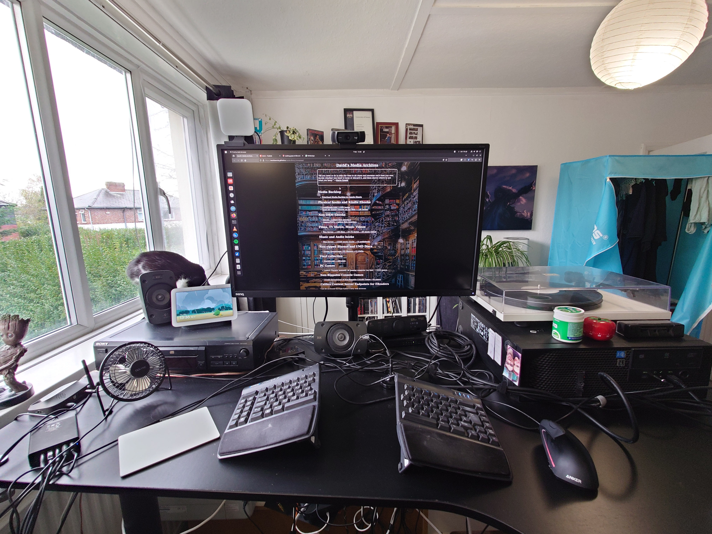

---
category:
  - pages
date: "2024-11-04T00:40:14+00:00"
guid: http://www.davidcraddocktutor.com/how-I-work
title: How I Work
url: /how-I-work
---

I am open and honest about how I work, so that there is no confusion and everything is above board.

* I offer an initial call for up to one hour, via Zoom or equivalent, for free. This is so we can gauge how I can help.
* Currently, I charge a flat fee of £20 / hour for my time. I am aware that this is a low fee for my experience, qualifications and current equipment. It takes into account the flexibility and working conditions that I require.
* I work from home, with any communication needed via Zoom video calling or equivalent.
* I work from 0 to 20 hours / week on your project until we are agreed it is complete. I submit time sheets. I have a lot of demands around my time, both personal and professional, and this arrangement is essential for meeting them.
* Any equipment, media licenses, ongoing costs or software that I do not have which I will need is charged extra for the duration of the project. I will provide a full list of what I have already and what we are likely to need at the start.
* Any travel or other expenses at all is charged extra. It is very unlikely that I will be travelling but if I do, that is extra.
* Whoever I'm working with will be required to sign a contract after the initial call, which just covers what I've already stated here.

## Find out More:
* [https://davidcraddocktutor.com/my-experience/](https://davidcraddocktutor.com/my-experience) - Find out about my experience
* [https://davidcraddocktutor.com/get-in-contact/](https://davidcraddocktutor.com/get-in-contact) - Get In Contact

