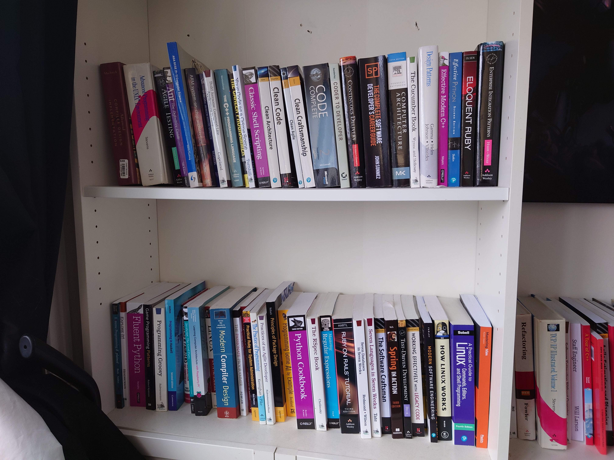

---
category:
  - pages
date: "2024-11-11T00:34:52+00:00"
guid: https://davidcraddocktutor.com/my-experience
title: My Experience
url: /my-experience/
---

I have 20 years professional experience in software development and IT-related positions. Some companies you may have heard of:
* I worked as a Senior Software Engineer on iPlayer at the BBC for several years, including managing a team of software engineers.
* Worked as a Senior Software Engineer at Arm for 2 years, the famous British semiconductor and software design company, on an Arm HPC C++ compiler.
* Worked at ITV as a Software Engineer on a payroll system that paid the stars of ITV.
* Briefly worked for public sector consultancy companies such as CGI and BAE Systems Digital Intelligence.
* I'm an open source software developer on my [vWorkbench](https://davidcraddock.net/vWorkbench) project, a comprehensive Linux-based software development environment.
* I'm currently studying for a distance-learning Masters in Cyber Security at the University of London, with direction from Royal Holloway college, one of the most prestigious Cyber Security research centres in the world.

## Programming Languages

In my career I have worked substantially with the following languages/technologies:
* JavaScript/Node.js
* Docker/Docker Compose
* Shell Scripting
* Python
* Ruby
* PHP

## Academic Credentials

* IT GCSE (B)
* Computing A-Level (B)
* BSc Computer Science and Artificial Intelligence from Sussex University (Honours)

## Courses Completed

Privately funded/employer funded courses:

* AWS Certificated Solution Architect (AWS Course)
* Agile/Scrum (Arm Ltd)
* Modern C++ For Embedded Systems (Feabhas)
* ISTQB Foundations Course (Arm Ltd)
* Certified Scrum Master Training (Arm Ltd)
* Cloud Computing (BBC Academy)
* Rapid Software Testing (RST – James Bach)
* SSL/TLS and Public Key Infrastructure (BBC Academy)
* Configuring and Maintaining Broadcast Streams (BBC Academy)
* DVB Lite (BBC Academy)
* Digital TV (BBC Academy)
* Java Refresher (BBC Academy)
* Linux: An Introduction – Open University module – Course number T155 (Open Universty)
* Object-oriented programming with Java – Open University – Course number M255 (Open University)
* Python (BBC Academy)
* Refactoring (Jason Goreman)
* Ruby and Cucumber (BBC Academy)
* Software Engineering (BBC Academy)
* Spring Systems Design in UML (Bradford Uni Masters-level course module)
* Web Engineering (Bradford Uni Masters-level course module)

## Find out More:
* [https://davidcraddocktutor.com/how-i-work/](https://davidcraddocktutor.com/how-i-work) - Find out How I Work
* [https://davidcraddocktutor.com/get-in-contact/](https://davidcraddocktutor.com/get-in-contact) - Get In Contact
